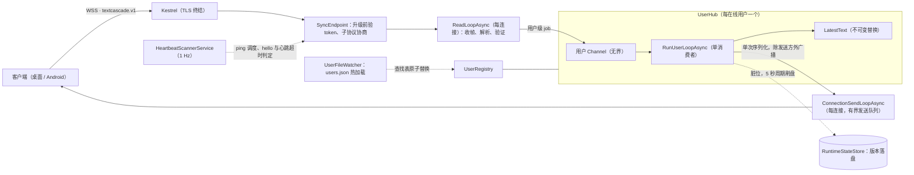
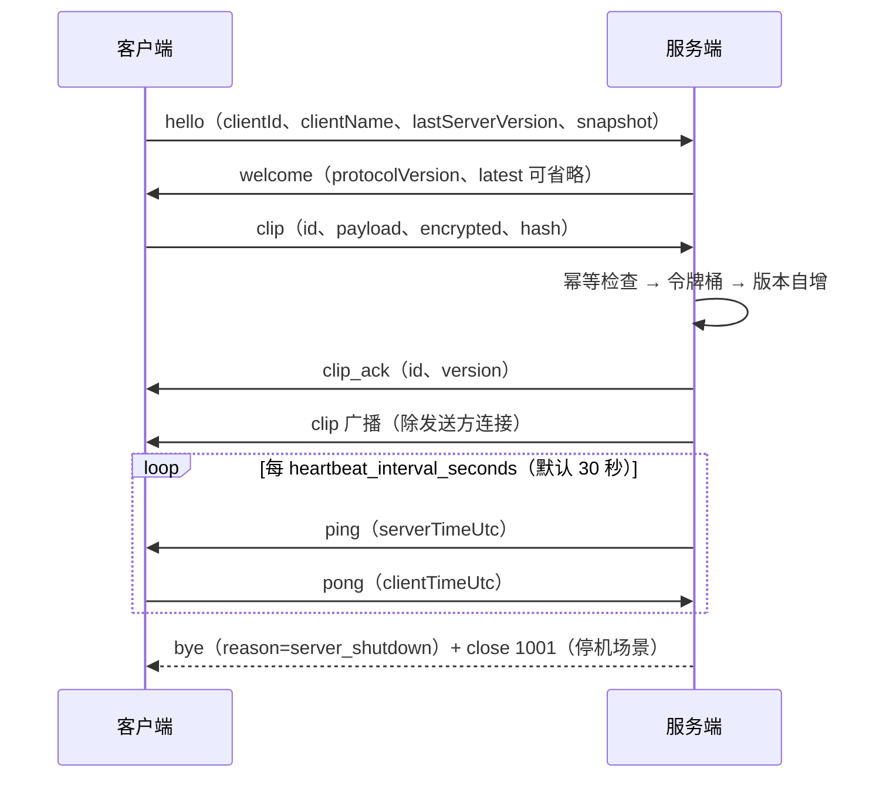

# TextCascade 轻量文本同步服务端规格

状态：与 v0.5.0 实现对齐  
日期：2026-09-05  
协议目标：不兼容原 ClipCascade，只做轻量、可靠、高性能的文本最新值同步

## 1. 目标与非目标

### 1.1 目标

- 仅同步文本最新值：每用户只保存一份当前文本，不保存历史。文本本体只在内存中；用户版本号经 RuntimeStateStore 周期落盘用于重启续接（见 3.4）。
- 无数据库：账号使用 `users.json`，版本号使用 `textcascade.state.json` 状态文件；除此之外无其他磁盘写入路径。
- 服务端重启可恢复：客户端用无状态 token 重连，并在恢复窗口内上报 snapshot；版本基准跨重启保持单调。
- 低空闲资源占用：无数据库轮询、无 WebUI、无 metrics endpoint。已知开销：RuntimeStateStore 每 5 秒脏检查刷盘、UserFileWatcher 每 30 秒轮询兜底重载。
- 明确边界：协议错误显式返回，慢连接被隔离或断开，绝不拖垮整个服务。
- 三端协议实现：服务端与桌面端使用 C#，Android 端使用 Kotlin；三端手写模型，由服务端契约测试约束。

### 1.2 非目标

- 不兼容原 ClipCascade 的 Spring、CSRF、JSESSIONID、STOMP 协议。
- 不支持图片、文件、剪贴板历史、离线消息队列、逐设备 ACK 状态。
- 不支持多实例分布式部署、数据库后端、管理后台或 WebUI。
- 不提供 Prometheus metrics；内部只保留轻量计数器。
- 不做 Socket.IO；使用原生 WebSocket。

## 2. 已定架构

整体结构与数据流：



### 2.1 运行时与进程

- 技术栈：ASP.NET Core Minimal API + Kestrel 原生 WebSocket。
- 目标框架：`net10.0`；产品版本采用 SemVer，写入 `TextCascade.Server.csproj` 的 `Version`（当前 0.5.0）。
- 进程模型：单进程；生产环境由 systemd 或 Windows Service 托管并负责崩溃自动重启。
- TLS：Kestrel 直接终止 TLS；不提供生产/开发模式开关，所有部署都禁止明文 HTTP 登录。TLS 协议版本跟随 OS 默认策略，未显式固定下限（见 8.2 与差距台账）。
- 部署产物：框架依赖单文件；目标机必须预装对应 .NET Runtime。

### 2.2 核心对象

- `ConnectionContext`：稳定属性，包括连接 ID、用户名、clientId、clientName、socket、认证信息；`Hub` 属性为 internal set，仅在临时连接转正时一次性赋值，此后不可变。
- `ConnectionStateBag`：可变运行时状态，包括 lastSeen、关闭标记、发送 Channel、HelloDeadline；修改收敛到少量明确函数。
- `UserHub`：每个在线用户一个 hub，持有最新值、版本号、幂等 SeenIdRing、令牌桶与用户 Channel（无界）。
- `UserRegistry`：`ConcurrentDictionary<string, UserHub>`，不同用户天然并发。
- `LatestText`：不可变 record，包含 payload、version、hash、encrypted、fromClientId、fromClientName、updatedAtUtc；更新即替换引用。
- `RuntimeStateStore`：版本号落盘存储（见 3.4）。

### 2.3 并发模型

1. 每个连接一个独立 `ReadLoopAsync`。
2. 读循环只负责收帧、解析、验证，然后把用户级 job 投递到 UserHub Channel。
3. 每个 UserHub 一个 `RunUserLoopAsync` 单消费者，串行处理该用户的 clip、pong 与恢复 job。
4. 广播时只序列化一次 UTF-8 字节，并把同一份字节投递到每个连接的有界发送 Channel。
5. 每个连接一个 `ConnectionSendLoopAsync`，慢连接只积压自己的队列。
6. 发送队列满立即取消该连接，不等待 drain，不补发应用层 error 或 WebSocket close frame。各广播/ACK/ping 满队列路径直接 `Cts.Cancel()`；统一清理由连接处理器的 finally 兜底完成。`EnqueueImmediateClose` 路径额外执行 `Socket.Abort()`。
7. 用户循环异常（含 `NextVersion` ulong 溢出抛出）触发 `RebuildHub`：取消该用户全部连接并重建 hub，进程存活——即版本溢出按"单用户熔断"处理而非进程级 fatal。

## 3. 配置与用户

### 3.1 配置函数

- `CreateDefaultConfig()`：内置安全默认值（RuntimeConfig.cs:51）。
- `LoadTomlConfig(path)`：读取可选 TOML 配置并覆盖默认值；支持 `--config <path>` 参数或 `TEXTCASCADE_CONFIG` 环境变量指定，回退顺序为 `--config` → `TEXTCASCADE_CONFIG` → 当前目录 `textcascade.toml`。
- `ApplyEnvironmentOverrides(config)`：环境变量覆盖，实际清单为 `TEXTCASCADE_BIND`、`TEXTCASCADE_PORT`、`TEXTCASCADE_CERTIFICATE_PATH`、`TEXTCASCADE_USERS_FILE`、`TEXTCASCADE_STATE_FILE`，以及 `token_secret_env` 所指名的 token secret 变量。
- `ValidateConfig(config)`：启动时强校验；非法值 fail-fast。仅服务端启动路径调用，CLI 故意不调用（CLI 无法要求 token secret 存在）。
- 服务端入口 `ServerHost.RunServer(args)` 加载证书后经 `ServerHost.CreateApp(args, config, users, stateStore, hasher, clock, certificate)` 构建 WebApplication。

默认配置文件示例：

```toml
[server]
bind = "0.0.0.0"
port = 8443
certificate_path = "certs/server.pfx"

[auth]
token_ttl_days = 30
token_secret_env = "TEXTCASCADE_TOKEN_SECRET"
argon2_memory_kib = 19456
argon2_iterations = 2
argon2_parallelism = 1

[limits]
max_text_bytes = 524288
max_frame_bytes = 589824
send_queue_capacity = 16
seen_id_capacity = 64
hello_timeout_seconds = 5
heartbeat_interval_seconds = 30
heartbeat_timeout_seconds = 60
snapshot_window_seconds = 3
snapshot_total_bytes = 4194304
recovery_clip_queue_capacity = 16

[rate_limit]
login_ip_per_minute = 10
login_user_per_minute = 5
max_keys = 10000
clip_burst = 10
clip_tokens_per_second = 2

[files]
users_file = "users.json"
state_file = "textcascade.state.json"
```

规则：

- 服务端不提供 production/environment 模式开关，安全校验不因部署环境降低。
- `token_secret_env` 指向环境变量名；token secret 不写入 TOML。
- token secret 必须由环境变量提供，长度至少 32 字节；缺失或过短时启动失败。
- TLS 始终启用；`certificate_path` 必须指向服务端可用证书。
- 证书支持无密码格式：`.pem` / `.crt` 必须是包含叶证书与未加密私钥的 PEM bundle（允许同名 `.key` 边车文件承载私钥）；`.pfx` / `.p12` 必须可无密码加载。遇到需要密码的 PFX 时启动失败。
- 私钥存储（v0.5.0 起）：PFX 在 Windows 上以 `DefaultKeySet` 持久化私钥加载（SChannel 无法用 ephemeral key 完成 TLS 握手），非 Windows 平台使用 `EphemeralKeySet`；PEM 在 Windows 上经 PFX 导出重导入以持久化私钥（CertificateLoader，ServerHost.cs）。
- TOML 使用宽松解析：必须以 UTF-8 读取（非 UTF-8 字节 fail-fast）；未知键忽略并输出 warning；结构或类型非法 fail-fast。**重复键视为解析错误直接启动失败**（Tomlyn 语义）。
- `max_frame_bytes` 必须大于 `max_text_bytes`，差额留给 JSON 协议头。
- 所有容量与时间配置必须大于 0，心跳超时必须大于心跳间隔。
- 校验顺序：Load → EnvironmentOverrides → ValidateConfig。

### 3.2 用户存储与热加载

文件：`users.json`

```json
{
  "nextTokenVersion": 3,
  "users": [
    {
      "username": "alice",
      "passwordHash": "$argon2id$...",
      "tokenVersion": 1,
      "disabled": false
    }
  ]
}
```

函数：

- `LoadUsers(path)`：启动时全量读取。
- `ValidateUsers(users)`：校验 `nextTokenVersion` 必填且大于所有用户 `tokenVersion`；校验用户名唯一、哈希格式、正数 `long` tokenVersion 与 disabled 字段。
- `BuildUserLookup(users)`：构造只读用户查找表。
- `SaveUsers(path, users)`：先 Validate 再临时文件原子替换（Windows `File.Replace`，POSIX rename），刷盘后才成功返回。

热加载（v0.3.0 起）：

- `UserFileWatcher` 以 `FileSystemWatcher` 监听 users.json 所在目录的 Changed/Created/Deleted/Renamed 事件，250ms 防抖；另有每 30 秒周期轮询兜底，即使未收到事件也无条件尝试重载。
- 重载失败按 50ms 退避重试 3 次；全部失败保留旧查找表并输出 warning。
- 成功后经 `SyncServer.ReplaceUserLookup` 原子替换（Volatile.Write）。登录与新 WebSocket 升级立即反映文件变更；已建立的连接不受影响（持旧上下文）。
- 服务端自身从不写入用户文件；删除或修改条目即刻影响新认证，被删/禁用用户的存量连接依赖其下次重连时被拒。

说明：

- `tokenVersion` 不是软件版本，而是账号 token 作废计数器。
- `tokenVersion` 与 `nextTokenVersion` 使用有符号 64 位整数（`long`），只允许正数，创建与递增时溢出即放弃操作。
- `nextTokenVersion` 是全局水位；新增用户取当前水位作为 `tokenVersion`，随后水位加一。
- `revoke-tokens` 将目标用户 `tokenVersion` 更新为当前水位，随后水位加一，保证未来新建任何账号都不会复用已撤销版本。
- 支持直接删除用户条目，不保留墓碑；之后重建同名用户时从全局水位取新 `tokenVersion`，因此不会落入旧 token 的版本空档。

### 3.3 用户 CLI

入口在同一服务端可执行文件中，不提供 WebUI。

```bash
TextCascade.Server user add --username alice        # 密码交互输入，或 --password-stdin
TextCascade.Server user passwd --username alice
TextCascade.Server user disable --username alice
TextCascade.Server user enable --username alice
TextCascade.Server user delete --username alice
TextCascade.Server user revoke-tokens --username alice
TextCascade.Server user list
TextCascade.Server user hash
TextCascade.Server serve                            # 启动服务（Program.cs 动词分发）
```

所有命令接受 `--config <path>`；CLI 写入 `users.json` 前先持有单实例文件锁（锁文件为 users.json 同目录 `users.json.lock`，以 `FileShare.None` 独占打开，持有进程退出或崩溃时由 OS 自动释放），再使用临时文件加原子替换。崩溃残留的锁文件会被直接复用、不再阻塞；锁文件中的 PID 仅作诊断用途，不参与锁判定。Windows 与 Linux 行为一致；检测到其它 CLI 实例仍持有锁时重试后失败退出。服务运行中修改文件的即时生效性见 3.2 热加载。

### 3.4 RuntimeStateStore（版本号落盘）

- 文件：`[files] state_file`，默认 `textcascade.state.json`；可用环境变量 `TEXTCASCADE_STATE_FILE` 覆盖。
- 格式：`{"entries":[{"username":"alice","version":129}, ...]}`。
- 写入时机：`PeriodicTimer` 每 5 秒对脏数据原子快照落盘；优雅停机时同步 flush；每次 clip 成功（`SaveVersion`）标记脏位。`SaveVersion` 采用单调 max 合并，防止乱序回退。
- 启动行为：`GetOrCreateHub` 用 `GetVersion(username)` 作为 hub 初始版本；状态文件结构非法（重复键、空 username、零版本）fail-fast。
- 该机制使重启后版本号跨重启单调增长（完整语义见 6.2）。

## 4. HTTP API

### 4.1 登录

```http
POST /api/v1/login
Content-Type: application/json
```

请求：

```json
{
  "username": "alice",
  "password": "raw-password"
}
```

实现要点：

- `AuthService.HandleLoginAsync(HttpContext, config, syncServer, logger)`：薄入口，HTTP 处理内联其中。
- 请求体限制 16KB、JSON 深度 3、拒绝未知字段与重复字段（v0.5.0 起：`ParseLoginRequest` 单次严格 `JsonSerializer.DeserializeAsync`，`MaxDepth=3`、`AllowDuplicateProperties=false`、`JsonUnmappedMemberHandling.Disallow`；16KB 上限经 `IHttpMaxRequestBodySizeFeature` 强制，chunked 请求体同样受限）；畸形请求体（缺字段、类型错误、非法 JSON）返回规格内统一形态之外的 `400 invalid_request`。
- 认证使用常数时间比较；不存在的用户以缓存的 dummy hash 执行同等验证，消除用户名存在性的计时侧信道。
- 限流命中返回 `429 Too Many Requests`，错误码 `rate_limited`；认证失败、用户不存在、用户禁用统一返回 `401 {"error":"invalid_credentials","message":"Invalid username or password."}`。

成功：

```json
{
  "token": "<compact-token>",
  "expiresAtUtc": "2026-09-17T00:00:00.0000000Z",
  "protocolVersion": 1,
  "maxTextBytes": 524288,
  "helloTimeoutSeconds": 5,
  "heartbeatIntervalSeconds": 30,
  "heartbeatTimeoutSeconds": 60,
  "needsRehash": true
}
```

规则：

- `expiresAtUtc` 序列化为包含小数秒的 ISO 往返格式（"O"），非整秒。
- `needsRehash` 为条件可选布尔：Argon2 参数与当前配置不一致时才出现。
- 客户端通过 TLS 发送原始密码；客户端不做 Argon2id。
- 用户不存在与密码错误返回相同错误，避免枚举用户。
- Argon2 参数变化时，登录路径只输出 NeedsRehash warning 并在响应携带 `needsRehash`，不重写 `users.json`；用户通过 CLI `passwd` 设置新密码时才生成当前参数的哈希。

### 4.2 Token

格式：

```text
base64url(payload).base64url(hmac-sha256(payload, secret))
```

payload：

```json
{
  "sub": "alice",
  "ver": 1,
  "iat": 1760000000,
  "exp": 1762592000
}
```

Token JSON 规则：

- 服务端签发时按 `sub`、`ver`、`iat`、`exp` 固定字段序输出最小化 UTF-8 JSON。
- 验证时字段顺序无关，但拒绝重复字段与未知字段。
- `sub` 是非空用户名；`ver`、`iat`、`exp` 均为有符号 64 位整数范围内的正整数；`exp` 必须大于 `iat`。
- 数字不得以小数、指数或字符串形式表示。

核心函数（Auth.cs）：`CreateTokenPayload(user, now, ttl)`、`SignToken(payload, secret)`（HMAC-SHA256）、`TokenService.TryVerifyToken(compact, now, userLookup, out payload)`——验签常数时间、验过期、验用户存在、验 tokenVersion。

规则：

- HMAC 比较必须常数时间。
- token 默认 30 天，可由配置调整。
- token 无服务端状态，服务端重启后仍可验证。
- 用户被禁用、删除或 tokenVersion 变化后被拒：热加载场景立即生效于新的登录与升级请求；重启后同样拒绝，删除后重建同名用户会从全局水位分配更高 tokenVersion。

### 4.3 登录限流

核心类 `SlidingWindowLoginLimiter`：

- IP 与用户名双维度滑动窗口，任一超限即拒绝。
- 默认每 IP 每分钟 10 次，每用户名每分钟 5 次。
- 用户名维度统计所有登录请求；认证成功后清空该用户名窗口。
- IP 维度统计所有登录请求；认证成功不清空 IP 窗口。
- 限流器设置最大 key 数；达到上限时先清理全部过期项，仍满则拒绝新 key 的登录请求并返回 `429 rate_limited`。清理发生在每次访问时（RemoveExpired 全表扫描过期时间戳），比逐 key 惰性清理更积极。
- 单实例部署下不做分布式限流。
- 已知取舍：持有正确密码的攻击者可通过高频成功登录占满目标用户名窗口；接受该风险，以换取更简单的计数与重置规则。

### 4.4 健康检查

```http
GET /health     （亦响应 HEAD /health）
```

```json
{
  "status": "ok"
}
```

不暴露连接数、内存、用户数等内部统计。

## 5. WebSocket 协议

常态连接生命周期（升级前已完成 Bearer token 验证与子协议协商）：



### 5.1 连接建立

```http
GET /api/v1/sync
Authorization: Bearer <token>
Sec-WebSocket-Protocol: textcascade.v1
Upgrade: websocket
```

实现（Hosting/SyncEndpoint.cs 内联认证）：

- 升级前验 token；无效、过期、用户禁用或 tokenVersion 不匹配时不升级 WebSocket，直接返回 `401`。
- 只接受 `textcascade.v1` 子协议（Ordinal 精确匹配），不匹配返回 `400`；非 WebSocket 请求也返回 `400`。
- 认证成功后连接进入待 hello 状态，必须在 `hello_timeout_seconds`（默认 5 秒，自 ConnectionStateBag 构造时刻起算）内发送合法 hello，否则关闭。
- hello 通过验证前，连接不在广播列表中，由统一扫描器独立计时 hello 截止。

### 5.2 Client Hello

```json
{
  "type": "hello",
  "clientId": "stable-device-id",
  "clientName": "Windows-Desktop",
  "lastServerVersion": 128,
  "snapshot": {
    "payload": "...",
    "encrypted": true,
    "hash": "client-local-hash",
    "localModifiedAtUtc": "2026-08-18T08:00:00Z"
  }
}
```

解析与校验（Protocol.cs）：

- 全部字段必填：`lastServerVersion` 缺失、非整数或负数按 `invalid_message` 拒绝（未知值为语义上的 0 由客户端显式填 0 表达）。接受显式 `"snapshot": null`。
- `clientId`：UTF-8 字节数 1–128；`clientName`：0–128 字节；`hash` 上限 4096 字节。
- 时间戳 `localModifiedAtUtc` 仅接受两种精确形式：UTC `"yyyy-MM-ddTHH:mm:ssZ"` 或 ISO 往返格式，偏移必须为零。
- snapshot 仅在进程启动后的全局恢复窗口内参与选举；窗口结束后完整校验通过即丢弃，clip 是唯一文本写入路径。

### 5.3 Server Welcome

```json
{
  "type": "welcome",
  "protocolVersion": 1,
  "latest": {
    "version": 128,
    "payload": "...",
    "encrypted": true,
    "hash": "...",
    "fromClientId": "android-a",
    "fromClientName": "android",
    "updatedAtUtc": "2026-08-18T07:59:58Z"
  }
}
```

规则：

- **服务端内存无最新值时，`latest` 键整体省略**（序列化 WhenWritingNull），不会出现字面 `"latest": null`；三端解析器必须把"键缺失"当作"无最新值"。
- 恢复窗口开启时 welcome 延迟发送：等待窗口收尾完成 snapshot 选举后统一广播。
- 客户端收到相同 hash 或相同版本时可本地去重，不写剪贴板；hash 只用于本地剪贴板去重，服务端新旧值以版本为准。

### 5.4 发布文本

客户端：

```json
{
  "type": "clip",
  "id": "client-generated-unique-id",
  "payload": "...",
  "encrypted": true,
  "hash": "..."
}
```

服务端广播给同用户除发送方**连接**外的其他在线连接：

```json
{
  "type": "clip",
  "version": 129,
  "id": "client-generated-unique-id",
  "payload": "...",
  "encrypted": true,
  "hash": "...",
  "fromClientId": "windows-a",
  "fromClientName": "Windows-Desktop",
  "updatedAtUtc": "2026-08-18T08:01:00Z"
}
```

发送方收到 ACK：

```json
{
  "type": "clip_ack",
  "id": "client-generated-unique-id",
  "version": 129,
  "updatedAtUtc": "2026-08-18T08:01:00Z"
}
```

实现：`Protocol.ValidateClipMessage` 单函数按结构→语义→资源顺序早拒绝；`CheckFrameSize` 帧硬限制；`CheckPayloadSize` 文本限额；`SeenIdRing.IsUnchangedDuplicate/TryGetResult/RememberId` 幂等；`TokenBucket.TryAcquire` 用户级令牌桶；`CoreLogic.NextVersion` ulong 自增（溢出抛出触发 RebuildHub）。

幂等规则：

- `id` 已见过 **且 payload/hash/encrypted 与上次完全一致**：不生成新版本、不消耗令牌桶，返回原版本 ACK；重复 ACK 仍进入发送方有界发送队列，队列满时按慢连接取消。
- `id` 已见过但内容不同：记录 "Replacing reused clip id" warning 后**按全新消息处理**——消耗令牌桶、生成新版本并覆盖最新值。客户端不应复用已确认过的 id。
- 相同 `clientId` 的其他连接仍收到广播，仅发送方连接被排除。

其余规则：

- 客户端不携带版本号；版本由服务端按用户处理顺序生成。
- 空文本、非法 UTF-8、结构缺字段、超帧、超文本、限流超限均拒绝。
- `payload` 对服务端 opaque；`encrypted=true` 时服务端不解析内容。
- 客户端 E2E 载荷约定（桌面端 v2.3.0 起固化）：`encrypted=true` 时 payload 为紧凑 JSON，含 `nonce`/`ciphertext`/`tag` 三个 Base64 字段；AES-256-GCM，nonce 固定 12 字节（96-bit）、tag 固定 16 字节、无 AAD，密钥由密码 PBKDF2 派生；非 12 字节 nonce 客户端拒收。服务端不解析、不校验该结构，仅透传。
- 发送队列容量按消息条数计算，默认 16；队列满立即取消连接，不补发 error 或 close frame。
- 慢设备延迟到达的旧 clip 仍会获得新版本并覆盖最新值；这是最新值语义的预期行为，客户端需自行处理可能的回滚。

### 5.5 心跳

服务端定时发送应用层 JSON ping：

```json
{
  "type": "ping",
  "serverTimeUtc": "2026-08-18T08:02:00Z"
}
```

客户端必须返回：

```json
{
  "type": "pong",
  "clientTimeUtc": "2026-08-18T08:02:00Z"
}
```

实现：

- 统一扫描器 `HeartbeatScannerService`（`BackgroundService` 内 `PeriodicTimer` 驱动，扫描异常记入日志而非静默吞掉）固定每 1 秒运行一次，集中处理 ping 调度（间隔默认 30 秒）、hello 超时与心跳超时判定（默认 60 秒无 pong 取消连接）；检测延迟 0–1 秒，不提供独立配置。
- pong 更新 lastSeen 经用户 Channel 由单消费者落账；用户循环被大 clip 占用时 pong 记账可能延迟数秒。
- 收到没有未决 ping 的主动 pong，回复 `invalid_message` 错误帧但不断开连接（spec 外补充分支）。

### 5.6 错误

```json
{
  "type": "error",
  "code": "text_too_large",
  "message": "Text exceeds maxTextBytes.",
  "referenceId": "client-generated-unique-id"
}
```

`referenceId` 为 null 时该键省略。

| code | 含义 | 连接处理 |
|---|---|---|
| `invalid_message` | JSON 结构或字段非法 | 可继续 |
| `text_too_large` | 文本字段超限 | 可继续 |
| `frame_too_large` | 完整帧超限（含零长度帧） | 先发 error，关闭 1009 |
| `empty_text` | 空文本 | 可继续 |
| `rate_limited` | 用户级发送限流 | 可继续 |
| `hello_timeout` | 未按时发送 hello | 先发 error，关闭 1008 |
| `server_busy` | 发送队列拥塞 | 立即取消；该错误不保证发送 |

补充行为（实现事实）：

- 需要 close 的错误先发 error 帧、延时约 100ms 后再执行 close；同一连接同类错误只触发一次关闭流程（MarkClosed 守卫）。
- hello 到达前的任何非法或非 hello 消息：发 `invalid_message` 错误后以 1008 关闭（预 hello 阶段一律不接受业务帧；预 hello 帧超限走 1009）。
- 零长度帧判为 `frame_too_large` 关闭 1009。
- 慢连接发送队列满时不补发应用层 error，也不写 close frame，直接进入取消路径；`server_busy` 语义对客户端不可靠，客户端应靠重连兜底。

可预期协议错误走 Result；不可预期异常由顶层兜底汇入统一清理。

### 5.7 关闭与清理

- 各类取消源（心跳超时、慢连接、恢复队列满、协议异常、停机）最终都终结于连接取消令牌触发；`CancelConnection(connection, reason)` 是正常路径入口，部分高频满队列路径直调 `Cts.Cancel()`（见 2.3 第 6 条），清理一致性由读循环 finally 保证。
- 关闭 socket：普通场景 graceful close；`EnqueueImmediateClose` 场景 abort/dispose。

| close code | 含义 |
|---:|---|
| `1000` | 正常关闭 |
| `1001` | 服务端重启或维护 |
| `1008` | 策略关闭，例如 hello 超时、预 hello 非法消息 |
| `1009` | 帧过大 |

`1013` 与 `4408` 不是本协议 close code，客户端不得依赖。

hub 清理：

- 最后一个连接断开后 hub **不立即**从 registry 移除；统一扫描器在 hub 空闲满 **10 分钟**后回收空 hub（`LastActivityAt` 判定），窗口收尾清扫期间 `allowDuringRecovery=true` 即时移除仍空的 hub。
- 已知问题：被回收 hub 的用户循环任务因 Channel 未 Complete 而遗留挂起（见差距台账）。
- 客户端主动发 Close 帧时，读循环回 1000 后退出读循环但不立即取消连接 CTS；资源最迟在心跳超时扫描（≤~90 秒）回收，期间连接仍在广播列表中会被继续投递直到写出失败。

## 6. 最新值与恢复

### 6.1 正常运行

每个用户保存一个 `LatestText`：

- `payload`
- `version`
- `hash`
- `encrypted`
- `fromClientId`
- `fromClientName`
- `updatedAtUtc`

处理顺序：

1. 读循环收帧并检查帧大小。
2. JSON 解析与 `ValidateClipMessage`。
3. 投递到用户 Channel。
4. 用户单消费者执行幂等检查与令牌桶。
5. `NextVersion` 在当前版本基础上自增。
6. 不可变替换最新值并 `SaveVersion` 标记脏位。
7. 广播给除发送者外的连接，并向发送者返回 ACK。

这是最新值语义，不是可靠队列语义。离线设备不补历史，重连后只拿当前最新值。

### 6.2 服务端重启恢复

恢复窗口从服务端进程构建时间起算（`SyncServer.ProcessStartTime`），结束时间为 `processStartTime + snapshot_window_seconds`。该窗口对全部用户统一生效，不按 UserHub 创建时间或首个 hello 到达时间重新计算。1 秒扫描器在窗口结束后统一对所有 hub 执行收尾。

选举与恢复规则：

1. 版本基准来自 RuntimeStateStore：hub 初始版本 = 状态文件中该用户的持久化版本（无记录则为 0）。
2. `lastServerVersion=0` 的 snapshot 不参与选举；只过滤正版本候选。
3. 若没有正版本候选，恢复结果为空，welcome 不带最新值。
4. 候选中优先选择 `lastServerVersion` 最大者；并列取 `localModifiedAtUtc` 最新者；再平局取 `clientId` 字典序更大者。
5. **守卫**：winner 版本小于等于 hub 当前（持久化）版本，且两者相等时已有最新值的情形除外，否则放弃恢复（welcome 不下发）——持久化水位高于一切客户端认知时保持现状，下一条 clip 从持久化版本+1 继续。
6. 恢复成功时 `LatestText.version` 直接使用 winner 的 `lastServerVersion`（不加一），并回写 SaveVersion。
7. 恢复窗口内只收集 snapshot；合法 clip 进入独立有界恢复队列。
8. 每用户 snapshot 预算只统计候选 `snapshot.payload` 的 UTF-8 字节数总和，上限 `snapshot_total_bytes`，达到上限后拒绝新候选、保留既有候选；元数据开销不计入预算。
9. 恢复队列容量 `recovery_clip_queue_capacity`；满时断开提交者对应连接；连接断开其已排队 clip 丢弃。
10. 窗口收尾顺序：选举 winner → 恢复最新值 → 按到达顺序串行处理恢复队列 → 广播 welcome。

重启后的完整链路：

1. 服务端停机前广播 `bye` 并以 `1001` 关闭连接。
2. 客户端识别服务端维护，使用无状态 token 直接重试 WebSocket。
3. 服务端重启后 token secret 与 tokenVersion 未变，token 仍可验证；版本号跨重启单调。
4. 客户端 hello 上报 snapshot。
5. 3 秒窗口选举 winner。
6. 服务端恢复或保持最新值并继续同步。

### 6.3 慢连接

每个连接有独立有界发送 Channel：

- 默认容量 16 条消息。
- `TryWrite` 失败即判定慢连接。
- 立即取消该连接，不等待 drain，不补发应用层 error，也不写 close frame。
- 发送循环观测取消后退出；`OperationCanceledException` 与非取消异常都汇入统一清理路径。
- 满队列广播路径仅取消令牌、socket 随 finally dispose 回收；`EnqueueImmediateClose` 路径显式 `Socket.Abort()`，均不做 graceful 握手。
- 客户端重连后通过 welcome 拿最新值，不补发中间消息。

慢连接不能阻塞用户单消费者，也不能影响同用户其他连接。

## 7. 优雅停机

流程：

1. 收到 SIGTERM、Ctrl+C 或服务停止请求（Host 反向停止次序下 Kestrel 先停止接受新连接）。
2. 向 registry 中所有已 hello 连接广播：

```json
{
  "type": "bye",
  "reason": "server_shutdown"
}
```

3. 以 close code `1001` 逐一关闭上述连接；bye 经各自有界发送队列投递，队列已满的连接会被静默跳过（既无 bye 也无 1001）。
4. 等待最多 2 秒让 close frame 尽量发出。
5. 取消所有连接 CTS；随后 RuntimeStateStore 同步 flush 状态文件。
6. 清理 UserHub 与后台任务，进程退出交由系统服务管理器重启。

已知边界：处于预 hello 状态（pendingHellos）的连接不在 bye/1001 广播范围内，进程退出时随 socket 直接断开。

## 8. 日志与安全

### 8.1 结构化日志

实现（SecurityLogging.cs）：`LogSecurityEvent(this ILogger, eventName, params (string,object)[])` 输出扁平化的结构化事件；`RedactSensitive(value)` 用于脱敏。

规则：

- 密码绝不记录；token 不记录（代码中的 TokenPrefix 工具目前未被生产路径调用）。
- clip payload 与 hash 不记录；clip 事件只记 version、clipId、字节数、encrypted、来源设备。
- Authorization header 不进入任何日志。
- 登录相关事件不区分"密码错误"与"用户不存在"，也不出现"disabled"字样——全部折叠为 `reason=invalid_credentials`，防止枚举（测试锁定此行为）。

关键事件（实际字段）：

| 事件 | 字段 |
|---|---|
| login | username, ip, success[, reason]（失败必带 reason） |
| connect | username, clientId, connectionId |
| disconnect | username, clientId, connectionId, reason |
| clip | username, version, clipId, bytes, fromClientId, encrypted |
| reject | username, code, bytes |

### 8.2 传输与输入安全

- 生产只允许 HTTPS/WSS：`ServerHost.RunServer` 强制先加载证书，Kestrel 仅绑定单一 HTTPS endpoint。TLS 协议版本跟随 OS 默认策略，代码未显式设置 SslProtocols 下限；NetworkIntegration 测试以显式 Tls12/Tls13 客户端握手验证兼容性。
- 测试路径豁免说明：`ServerHost.CreateApp` 的 certificate 形参允许传 null 构建纯 HTTP 主机，仅测试可达（InternalsVisibleTo 之下），生产入口不可能走到。
- 不启用 CORS。
- 不设置 Cookie，无 CSRF 面。
- 登录请求体上限 16KB；登录与协议帧 JSON 深度限制均为 3。
- 协议消息与登录请求只接受契约定义字段；重复字段与未知字段拒绝。若未来新增可选字段，必须提升或明确协议兼容策略。

## 9. 性能目标

性能目标、测量场景与实测结果由仓库根目录的 [perf.md](../perf.md)（中英双语）承载，作为构建基准设施的契约；未验证的目标不作为承诺。（协议层面保留的设计性质：广播单次 UTF-8 序列化、每连接有界发送队列、空闲路径只有心跳扫描与周期刷盘。）

## 10. 测试计划

本节自包含描述测试现状与分层，不依赖外部文件。集成测试机制自 v0.3.0 起采用真实 Kestrel 绑定 `127.0.0.1:0` 的 fixture（`ServerHost.CreateApp` 构建 + FastPasswordHasher 注入）。

### 10.1 纯单元测试（现有覆盖）

- `SignToken`/`TryVerifyToken`：往返、过期、tokenVersion 撤销、篡改、未知字段、禁用用户、用户缺失。
- CLI 单实例文件锁（`FileShare.None`）：活跃互斥、崩溃残留锁文件可复用、锁路径校验。
- `SlidingWindowLoginLimiter`：双维度、跨 IP、成功仅清用户窗口、max keys、过期清理。
- `TryAcquireClipToken`（TokenBucket refill）、`CheckFrameSize`/`CheckPayloadSize`、SeenIdRing 去重与淘汰、`NextVersion` 含 ulong.MaxValue 抛出、`SelectSnapshotWinner` 三规则。
- Argon2 三函数（SlowHash）、token 数字全形态、CLI 水位/溢出、WithVersion、重复 id 行为级断言均已由测试覆盖。
- 证书加载（CertificateLoaderTests）：PEM RSA/ECDSA 证书、合并 bundle 与独立 `.key` 边车、缺私钥与无证书内容的拒绝路径。

### 10.2 CI 集成测试：真实 Kestrel loopback

现有 `WebSocketIntegrationTests` 覆盖：登录与握手往返（含 welcome）、无效 token 不升级、两客户端广播与发送方 ACK、重复 id 同版本 ACK、断连后按最高 lastServerVersion 快照恢复（结合版本持久化）、突兀断开被记录且服务存活（日志不含密码/secret）。

计划中的补齐用例（子协议 400、hello 超时、NeedsRehash 不重写 users.json、同 clientId 排除规则、用户隔离、慢连接取消）尚未实施，落地后回填本节；bye/1001 停机链路已由 §10.3 网络集成测试覆盖。

### 10.3 本地网络测试：Category=NetworkIntegration

```bash
dotnet test TextCascade.Server.slnx --filter Category=NetworkIntegration
```

CI 主测试任务以 `--filter "Category!=NetworkIntegration"` 排除该类别，由独立 CI 任务运行。覆盖：自签证书 TLS/WSS、显式 Tls12/Tls13 握手、随机端口绑定、真实帧分片、超限帧 1009、重启两次 CreateApp 后 token 直连与快照恢复、停机 bye/1001、HTTPS 登录全链路。

### 10.4 契约测试

样本文件组织于 Tests 项目 `ContractSamples/`（valid/invalid 分类、非法数字与非法 UTF-8 全矩阵、深度 4、重复/未知字段），由 Theory 驱动断言 `ParseClientMessage` 结果与序列化字节不变式；样本文件同时作为三端实现的公共对拍集合。

## 11. 客户端适配要求

客户端需要实现：

1. `POST /api/v1/login` 获取 token。
2. Authorization header + `textcascade.v1` 子协议建立 WebSocket。
3. 在登录响应返回的 `helloTimeoutSeconds` 内发送 hello，并携带本地 snapshot。
4. 应用层 ping/pong。
5. clip 发送、ACK、接收。
6. 保存服务端 version，重连时上报 `lastServerVersion`。
7. 收到相同 hash 或相同版本时不写剪贴板；收到更晚到达的旧 clip 仍可能覆盖本地文本。
8. 解析 welcome 时将 `latest` 键缺失视为"无最新值"。
9. `1001` 后按服务端维护重连；token 未过期时优先直接重连。
10. `401`、token 过期或 tokenVersion 失效时重新 HTTP 登录。
11. 重连退避建议：1s、2s、5s、10s、30s、60s，之后固定 60s；收到 1001 时初期退避更温和。

保留客户端原有能力：

- 本地剪贴板监听。
- hash 去重。
- 远端写入后的本地事件抑制。
- 密码派生 AES-GCM 加密。
- 密码安全保存与自动登录。

## 12. 实施里程碑

### M1：协议骨架 —— 已达成

配置加载与校验、users.json 与 CLI、登录端点、HMAC token、WebSocket 升级认证与子协议协商、hello/welcome、文本广播与 ACK、单元与集成测试基座。

### M2：可靠性 —— 已达成

用户 Channel 单消费者、有界发送队列与立即取消、幂等 id、服务端版本号与不可变最新值、应用层心跳、统一取消清理。

### M3：恢复与真实网络 —— 已达成，补齐用例见 §10.2

优雅停机 bye/1001、快照恢复窗口与预算/队列约束、tokenVersion 撤销、版本号持久化；真实 TCP/TLS 集成测试已落地（§10.3），其余补齐用例见 §10.2。

### M4：生产化 —— 大体达成，两项移交差距台账

Kestrel TLS、结构化日志与脱敏、登录与消息限流、框架依赖单文件发布、systemd/发布管线均已落地；性能基准由 perf.md 实测承载（见第 9 节）。

## 13. 版本与发布

- 产品版本采用 SemVer 2.0.0，从 `0.1.0` 开始演进，以 `TextCascade.Server.csproj` 的 `Version` 为准（当前 0.5.0）。
- `protocolVersion` 只表示线协议版本，当前为 `1`，与产品版本独立演进。
- 目标框架为 `net10.0`；目标机必须预装兼容的 .NET 10 Runtime。
- 发布命令：`dotnet publish TextCascade.Server.csproj -c Release -p:PublishSingleFile=true`（win-x64/linux-x64 框架依赖单文件）。
- 本地编译命令：`dotnet build TextCascade.Server.csproj -c Release`。

## 14. 决策台账

| 问题 | 结论 |
|---|---|
| 最大文本默认值 | 512KB |
| 最新值文本本体磁盘持久化 | 不做，文本只在内存 |
| 版本号持久化 | 做：v0.2.5 起 RuntimeStateStore 落盘 textcascade.state.json，版本跨重启单调 |
| 用户配置热加载 | 做：v0.3.0 起 UserFileWatcher 监听 + 轮询兜底，新认证即刻生效 |
| token 生命周期 | 长期 token + tokenVersion 撤销 |
| 删除后重建用户 | 全局 nextTokenVersion 水位 |
| metrics | 不启用 endpoint |
| 协议包 | 三端手写，服务端契约测试约束 |
| 关闭码 | 应用层 error + 标准 close code；不发送 1013/4408 |

## 15. 实现差距台账（知悉现状，不构成承诺）

以下为实现偏离或已知缺陷，如实记录、供排期参考：

1. 优雅停机不覆盖预 hello 连接（见 §7 已知边界）。
2. 空 hub 10 分钟回收时，其用户循环任务因 Channel 未 Complete 而永久挂起，每个被回收 hub 遗留一个 parked task。
3. 部分队列满路径绕过 `CancelConnection` 入口直调 `Cts.Cancel()`，早退清理一致性依赖 finally（见 2.3）。
4. TLS 协议下限未显式固定，依赖 OS 默认（§8.2）。
5. `ServerHost.CreateApp(certificate:null)` 的明文测试缝隙（仅 InternalsVisibleTo 可达）。
6. ApplyClip 中 duplicateId 且 Latest 为 null 的兜底分支不可达（死分支）。
7. §10 中标注"待补齐/补齐中"的测试项尚未实施，落地后回填本 spec。
8. 优雅停机对每个连接的 `CloseAsync` close 握手等待无超时：有静默客户端在线时，停机阶段实测可达 34 秒（perf.md S7）；§7 的"等待最多 2 秒"仅覆盖握手完成后的 drain。
9. 发送队列满的熔断路径（`MarkClosed` + `Cts.Cancel`）不产生 disconnect 安全事件：后续 `CancelConnection` 因 `MarkClosed` 已置位而提前返回，被熔断的连接在日志中不可见（perf.md S6）。

实测性能数据见仓库根目录 [perf.md](../perf.md)。
